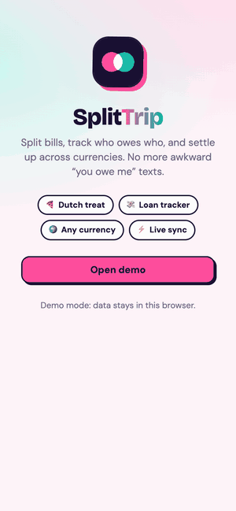
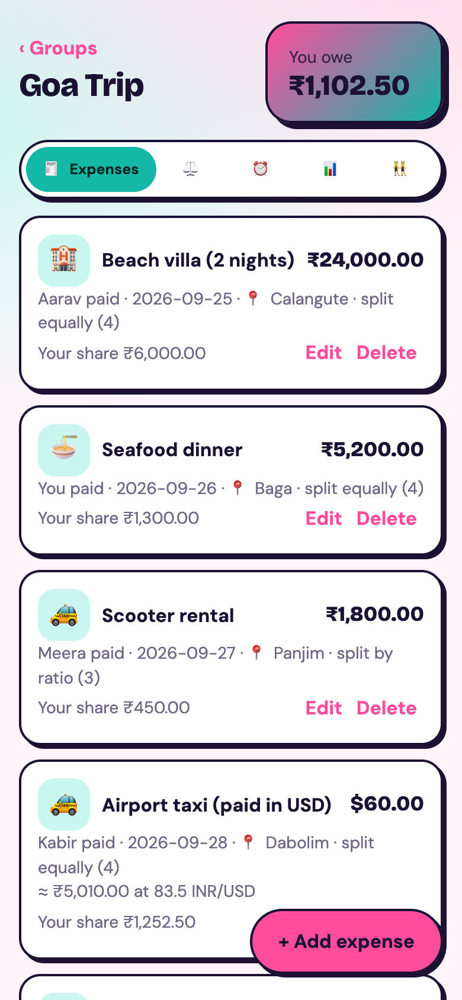
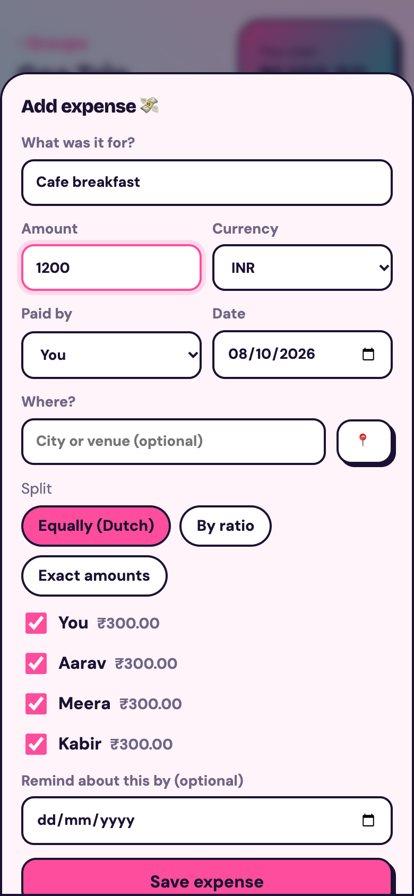
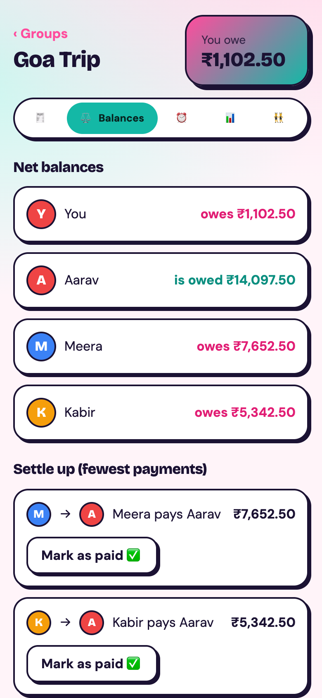
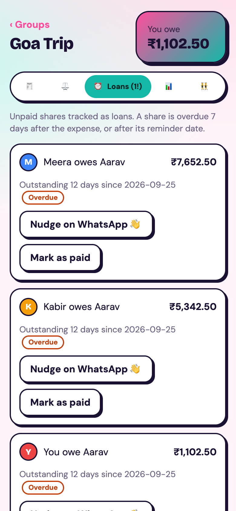
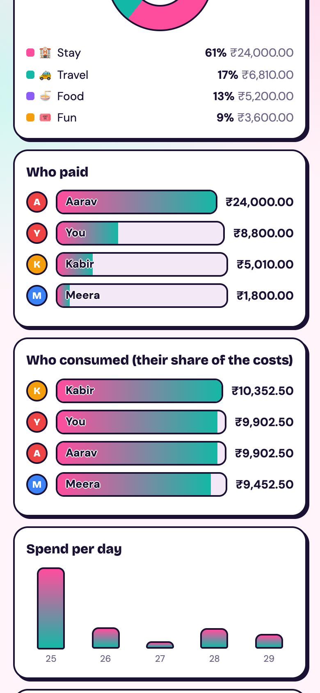

# SplitTrip

[](https://github.com/vaibhavirawat/splittrip/actions/workflows/ci.yml)


**Split bills, track who owes who, and settle up across currencies, even when everyone is in a different place.**

### [Live demo: splittrip-in.web.app](https://splittrip-in.web.app)
Tap **Try as guest**, then **Load a sample trip** to see every feature with ready-made data.

<p align="center"></p>

SplitTrip is a Progressive Web App that implements the PBL paper *"Development of a Comprehensive Payment and Expense Management App for Group Transactions, Loan Tracking, and Automatic Payment Calculation in Multi-Location Scenarios"*. It runs in any browser and installs to a phone home screen.

## Features

| | |
|---|---|
| **Flexible splitting** | Equal (Dutch treat), by ratio, or exact amounts. Shares always add up to the exact total, with no lost paise. |
| **Multi-currency** | Each expense keeps its own currency and the exchange rate for the expense date (fetched automatically, editable). |
| **Multi-location** | Tag where each expense happened, with optional GPS place detection. |
| **Loan tracking** | Unpaid shares become loans with age, overdue badges, due dates and one-tap WhatsApp nudges. |
| **Smart settle-up** | The fewest payments that clear everyone's balance, plus "mark as paid". |
| **Insights** | Spend by category, who paid vs who consumed, daily spend, biggest expense, foreign spending. |
| **Real-time sync** | Everyone in a group sees changes instantly (Firestore live listeners). Invite people with a link. |
| **UPI settle-up** | Pay with a `upi://pay` deep link (Google Pay, PhonePe, Paytm, BHIM) or scan a generated QR code. Each member can save a UPI ID. |
| **Razorpay (test mode)** | Optional checkout flow for settling up, with no real money moved. |
| **Edit anything** | Edit or delete expenses; the saved exchange rate is preserved. |
| **Works offline-ish** | Installable PWA with a service worker; offline demo mode with local data when no backend is configured. |

## Screenshots

<p align="center">
  
  
  
  
  
</p>

## Tech stack

- **Frontend:** React 19, TypeScript (strict), Vite, React Router
- **Backend (serverless):** Firebase Authentication (Google and anonymous), Cloud Firestore, Firebase Hosting
- **Payments:** UPI deep links and QR codes (`qrcode`), optional Razorpay Checkout (test mode)
- **Data APIs:** Frankfurter (historical FX rates), OpenStreetMap Nominatim (place names)
- **Quality:** Vitest unit tests, GitHub Actions CI, Firestore security rules
- **PWA:** vite-plugin-pwa (manifest and service worker)

## How it works

The interesting part is `src/lib/split.ts`: pure, framework-free, unit-tested money logic.

1. **Integer money.** Every amount is stored in minor units (paise/cents), so there is no floating-point drift.
2. **Exact splitting.** `allocate()` uses the largest-remainder method so shares always sum to the total.
3. **Balances.** `balances()` credits the payer and debits each participant in the group's base currency (using the rate stored with each expense). All balances always sum to zero.
4. **Settle-up.** `settle()` greedily matches the biggest debtor with the biggest creditor: at most *n - 1* payments.
5. **Loans.** `loans()` dates each debt from the oldest unpaid shared expense and flags it overdue after a due date or a grace period.

The UI talks only to a small `Store` interface, with two implementations: `cloud.ts` (Firestore) and `local.ts` (localStorage). That adapter pattern is why the app runs with zero setup in demo mode and why the logic is easy to test.

```
React pages ──► Store interface ──► Firestore (real-time)   ◄── security rules
     │                    └──────► localStorage (demo mode)
     └──► split.ts (pure money logic, unit tested)
```

## Run locally

```bash
npm install
npm run dev      # no .env needed: runs in offline demo mode with sample data
npm test         # unit tests for the split / balance / settle / loan / insights engine
```

## Deploy your own copy

1. Create a Firebase project. Enable **Authentication** (Google and Anonymous) and **Firestore** (production mode).
2. Copy `.env.example` to `.env` and fill in your Firebase web config (and optionally a Razorpay `rzp_test_` key id).
3. Deploy:
   ```bash
   npx firebase login
   npx firebase use <your-project-id>   # then set your own site ids in firebase.json
   npm run deploy      # builds, then publishes hosting and the Firestore rules
   ```

## Project structure

```
src/lib/        split.ts (core logic), insights.ts, rates.ts, razorpay.ts, sample.ts, notify.ts ...
src/store/      types.ts (Store interface), cloud.ts (Firestore), local.ts (demo)
src/pages/      Login, Groups, GroupPage, Join
src/components/ ExpenseForm, Insights, Avatar, CountUp
firestore.rules members-only access; append-only payments
```

## Limitations and roadmap

- UPI payments happen in the user's own UPI app, so SplitTrip cannot verify them; the payer confirms with "I've paid". Razorpay runs in **test mode** only and would need server-created orders and signature verification in production.
- Reminders are in-app, WhatsApp links and browser notifications while the app is open. Background push (FCM plus a scheduled function) is planned.
- Planned: receipt scanning, offline-first writes, end-to-end tests, optimal settle-up for small groups.

## License

MIT
